# System Architecture · Clean Architecture 四層相依圖

> 對應 `CryptoBot_Dev_Protocol.md` §1 — 此圖為唯一合法的相依方向。任何 PR 違反此圖視同違憲。

## 1. 全景：四層 + 主要元件

```mermaid
flowchart TB
    %% ─── ConsoleApp 組合根 ───
    subgraph CA["🖥️ ConsoleApp (Composition Root)"]
        direction TB
        Program["Program.cs<br/>BuildApp / DI"]
        Blazor["Blazor Server<br/>Pages · Components"]
        Hub["TradeHub<br/>(SignalR)"]
        Bus["DashboardEventBus<br/>(in-process bus)"]
        Lab["Lab/<br/>StrategyCatalog<br/>LabStateContainer"]
        Orch["OptimizationOrchestrator<br/>(Singleton + Gate)"]
        MinApi["Minimal APIs<br/>/api/lab · /api/strategy · /api/dashboard"]
    end

    %% ─── Application 業務層 ───
    subgraph AP["⚙️ Application (Use Cases)"]
        direction TB
        IStrategy["IStrategy<br/>+ SmaCrossoverStrategy<br/>+ TrendFollowing / MeanReversion / Arbitrage"]
        StratExec["StrategyExecutor<br/>StrategyRuntimeHostedService"]
        Sync["AccountSynchronizer"]
        Backtest["BacktestEngine<br/>StrategyOptimizer"]
        AppIfaces["IExchangeClient<br/>IHistoricalDataProvider<br/>IHistoricalKlineStore<br/>IRealtimeBroadcaster"]
    end

    %% ─── Domain 純核心 ───
    subgraph DM["💎 Domain (Pure Core)"]
        direction TB
        Aggregates["Aggregates<br/>Order · Position · Strategy · Kline"]
        VOs["Value Objects<br/>Symbol · Price · Quantity · Money · Leverage"]
        DomainSvc["Domain Services<br/>PositionSizingService"]
        DomainIfaces["Repositories<br/>IOrderRepository<br/>IStrategyRepository<br/>IPositionRepository"]
        DomainEvents["Domain Events"]
    end

    %% ─── Infrastructure 介面實作 ───
    subgraph INF["🔌 Infrastructure (Adapters)"]
        direction TB
        BingX["BingXExchangeClient<br/>BingXMarketDataStream<br/>(ListenKey lifecycle)"]
        EF["AppDbContext<br/>EF Core + SQLite<br/>Repositories"]
        Hist["HistoricalKlineStore<br/>HistoricalDataProvider"]
        SignalR["SignalRRealtimeBroadcaster<br/>(IHubContext fan-out)"]
        Seeder["InitialStrategySeeder<br/>DiscordNotifier"]
    end

    %% ─── 相依方向（唯一合法）───
    CA -->|references| AP
    CA -->|references| INF
    CA -->|references| DM
    AP -->|references| DM
    INF -->|implements interfaces of| AP
    INF -->|implements interfaces of| DM

    %% ─── 元件間實際呼叫 ───
    Blazor -.subscribes.-> Bus
    Blazor -.injects.-> Lab
    Lab -.subscribes.-> Bus
    Orch -.raises.-> Bus
    Orch -.broadcasts.-> Hub
    MinApi -.invokes.-> Orch
    Orch -.uses.-> Backtest
    StratExec -.uses.-> IStrategy
    Sync -.uses.-> AppIfaces
    BingX -.implements.-> AppIfaces
    EF -.implements.-> DomainIfaces

    classDef domain fill:#1de98233,stroke:#1de982,color:#e6e8ee
    classDef app fill:#4dd0e133,stroke:#4dd0e1,color:#e6e8ee
    classDef infra fill:#f5b30133,stroke:#f5b301,color:#e6e8ee
    classDef host fill:#ff4d6d33,stroke:#ff4d6d,color:#e6e8ee
    class DM,Aggregates,VOs,DomainSvc,DomainIfaces,DomainEvents domain
    class AP,IStrategy,StratExec,Sync,Backtest,AppIfaces app
    class INF,BingX,EF,Hist,SignalR,Seeder infra
    class CA,Program,Blazor,Hub,Bus,Lab,Orch,MinApi host
```

## 2. 為什麼這樣切

| 層 | 職責 | 依賴 | 不依賴 |
|---|---|---|---|
| **Domain** | 業務規則、實體、值物件、Repository **介面** | 只有 BCL | EF / BingX / SignalR / Web 任何東西 |
| **Application** | 用 Domain 編排 use case；定義「需要的能力」介面 | Domain | 任何 Infrastructure 實作 |
| **Infrastructure** | 把外部世界（DB / Exchange / SignalR）翻譯成介面 | Domain + Application | ConsoleApp |
| **ConsoleApp** | DI 組裝、Web Host、Blazor、Hub、Endpoints | 全部三層 | — |

## 3. 元件相依矩陣（簡表）

| 元件 | 屬於 | 主要相依 |
|---|---|---|
| `OptimizationOrchestrator` | ConsoleApp | `IServiceScopeFactory`、`DashboardEventBus`、`IHubContext<TradeHub>` |
| `LabStateContainer` | ConsoleApp/Lab | `DashboardEventBus`、`StrategyCatalog` |
| `BacktestEngine` | Application | `IHistoricalKlineStore`、`IStrategy`、`IExchange` 介面 |
| `BingXMarketDataStream` | Infrastructure | `BingXExchangeClient` (ListenKey REST + WS) |
| `SmaCrossoverStrategy` | Application | 純 Domain 物件，無 IO |

## 4. 一頁讀懂

> 想加新功能？先想：**它應該在哪一層？**
> 想呼叫一個別層的東西？先想：**箭頭方向對不對？**
> 對不上？**回去讀憲章 §1.2**。
