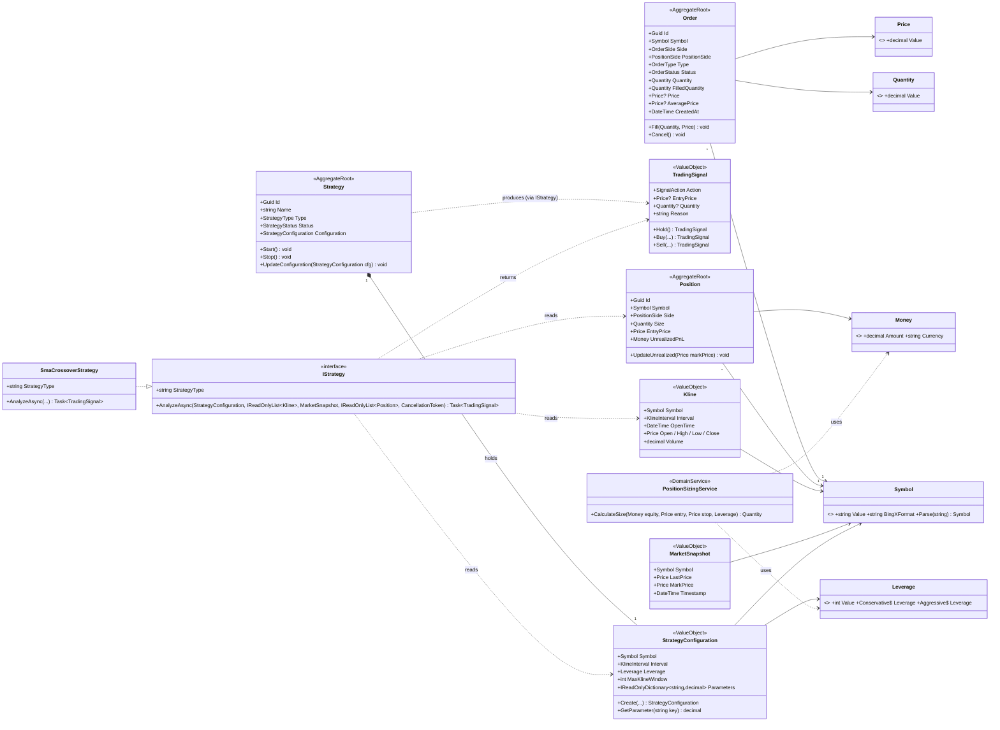
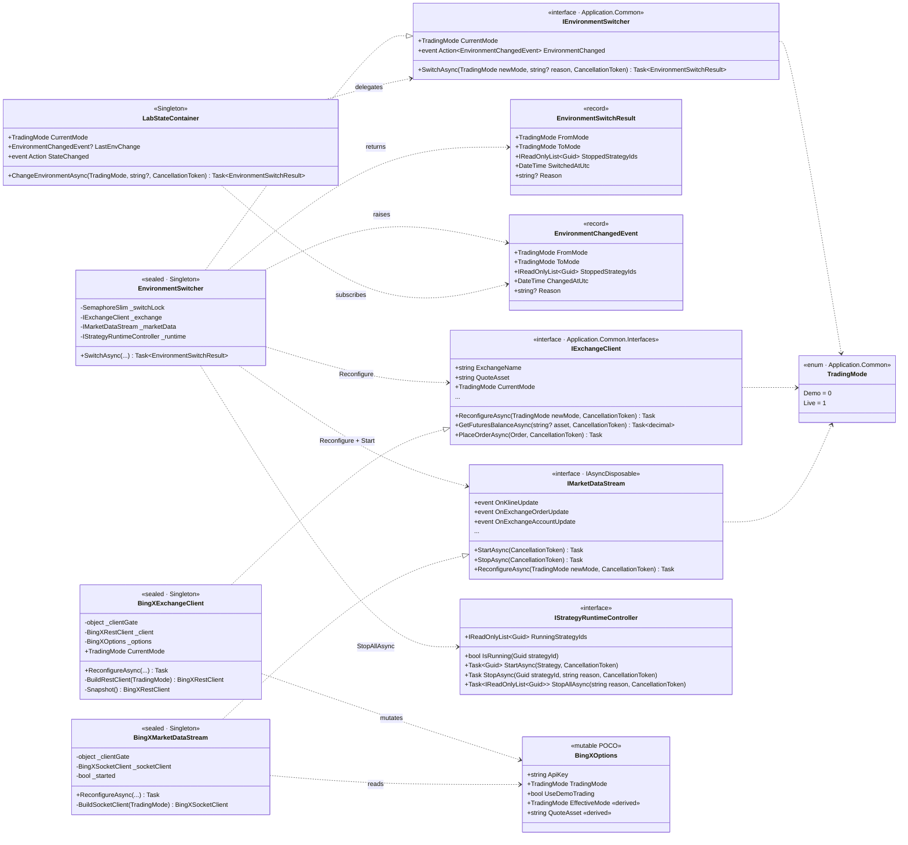

# UML · Core Domain Class Diagram

> 涵蓋 Domain 核心 Aggregate / Value Object / Domain Service，加上 Application 層的 `IStrategy` 與 Lab 的策略插槽契約 (`StrategyParameterFormBase` / `StrategyCatalog` / `OptimizationRequest`)。

## 1. Domain Aggregates + Value Objects + IStrategy

## 2. Strategy Slot 協議（Lab 插槽契約）

```mermaid
classDiagram
    direction LR

    class StrategyCatalog {
        -List~StrategyModel~ _models
        +IReadOnlyList~StrategyModel~ Models
        +StrategyModel Default
        +FindByKey(string key) StrategyModel?
        -Register(StrategyModel) void
    }

    class StrategyModel {
        <<record>>
        +string Key
        +string DisplayName
        +string Subtitle
        +Type? FormComponent
        +bool IsLocked
    }

    class LabStateContainer {
        <<Singleton>>
        +StrategyModel SelectedModel
        +OptimizationProgressUpdate? Progress
        +OptimizationCompletedUpdate? Leaderboard
        +string? LastError
        +bool IsRunning
        +TimeSpan? Elapsed
        +TimeSpan? EstimatedRemaining
        +event Action StateChanged
        +SelectModel(string key) void
        +NotifyJobStarting(int total) void
    }

    class StrategyParameterFormBase {
        <<abstract ComponentBase>>
        +bool Disabled
        +EventCallback~int~ ParameterChanged
        +int CurrentGridSize *
        +BuildRequest(DateTime, DateTime, out string?) OptimizationRequest? *
        #NotifyChangedAsync() Task
    }

    class SmaParameterForm {
        -decimal _fastMin / _fastMax / _fastStep
        -decimal _slowMin / _slowMax / _slowStep
        +int CurrentGridSize
        +BuildRequest(...) OptimizationRequest?
    }

    class OptimizationRequest {
        <<record>>
        +decimal FastMin / FastMax / FastStep
        +decimal SlowMin / SlowMax / SlowStep
        +DateTime StartUtc
        +DateTime EndUtc
    }

    class OptimizationOrchestrator {
        <<Singleton>>
        -SemaphoreSlim _gate
        +bool IsRunning
        +TryStart(OptimizationRequest) bool
        -RunAsync(...) Task
    }

    class DashboardEventBus {
        +event Action~OptimizationProgressUpdate~ OptimizationProgress
        +event Action~OptimizationCompletedUpdate~ OptimizationCompleted
        +event Action~OptimizationFailedUpdate~ OptimizationFailed
        +RaiseOptimizationProgress(...) void
        +RaiseOptimizationCompleted(...) void
        +RaiseOptimizationFailed(...) void
    }

    StrategyCatalog "1" *-- "*" StrategyModel
    StrategyModel ..> StrategyParameterFormBase : FormComponent typeof
    SmaParameterForm --|> StrategyParameterFormBase
    LabStateContainer "1" --> "1" StrategyCatalog : default model
    LabStateContainer ..> DashboardEventBus : subscribes
    OptimizationOrchestrator ..> DashboardEventBus : raises
    OptimizationOrchestrator ..> OptimizationRequest : consumes
    StrategyParameterFormBase ..> OptimizationRequest : builds
```

## 3. 環境熱切換契約 (S21)

### 設計亮點

| 設計 | 為什麼 |
|---|---|
| `TradingMode` 放在 `Application.Common` 而非 Infrastructure.Configuration | Application 介面（`IExchangeClient.CurrentMode`、`IMarketDataStream.ReconfigureAsync`）需要參照它 — 放 Infrastructure 會違反相依方向 |
| `IEnvironmentSwitcher` 在 Application 而非 Infrastructure | 編排服務跨 `IExchangeClient` + `IMarketDataStream` + `IStrategyRuntimeController` 三個 Application 介面，本身沒有任何 BingX 知識 |
| `BingXOptions` 變 mutable POCO，`EffectiveMode` 是衍生屬性 | `IOptions<T>` 是建構期 snapshot，切換後不更新；改 mutable + derived 才能讓 `CurrentMode` 立即反映 |
| `_clientGate` 物件鎖而非 `lock(this)` 或 `lock(_options)` | 專屬鎖避免外部偶然 lock 同一物件造成 deadlock；`Dispose` 舊 client 在 lock 外執行 |
| 切換後**不**自動重啟策略 | 強制使用者手動 Start = 二次人為確認，杜絕「demo 配置打 live 訂單」 |

## 4. 讀圖規則

- `*` 為 abstract / 必須 override 的成員。
- `<<...>>` 為 stereotype，標出該型別的角色（Aggregate / ValueObject / Singleton / record / interface）。
- 實線箭頭 = 組合 / 強相依；虛線箭頭 = 使用 / 訊息傳遞。
- 三角形空心箭頭 (`..|>`) = 介面實作。

## 5. 設計決策摘要

| 決策 | 為何 |
|---|---|
| `StrategyConfiguration.Parameters` 用 `Dictionary<string, decimal>` 而非 strong-typed 子類 | 換策略不必碰 Domain；`decimal` 維持金融精度 |
| `IStrategy` 簽章只吃 Domain 物件 | 純函式 → 可重放、可單測、不會被 IO 污染 |
| `OptimizationRequest` 是 record，欄位 = 兩維 SMA + 時間窗 | 對應目前唯一的 active 策略 SMA；新策略需擴充時改成 sealed hierarchy 或 polymorphic payload |
| `LabStateContainer` 是 Singleton 而非 Scoped | Blazor Server 多 circuit、刷新、跨 tab 都要看到同一份狀態；多人模式才需要改 Scoped |
